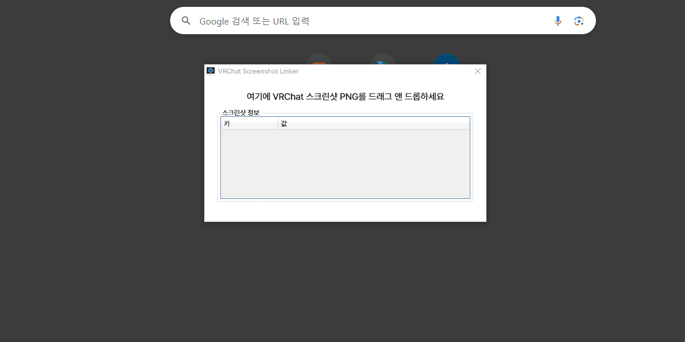

# VRChat Screenshot Linker

A simple tool to generate direct links to VRChat World based on VRChat screenshots.
Note: This tool only works with screenshots taken in VRChat, when using VRCX.

## Features

- Drag and drop a VRChat screenshot onto the application to generate a direct link to the world.
- Show parsed information such as World Name, Author, and Instance.

## Requirements

- .NET 8.0

## Usage

1. Download the latest release from the [Releases](https://github.com/gwarnryo/VRChatScreenshotLinker/releases)
2. Run the application.
3. Drag and drop a VRChat screenshot onto the application window.
4. The application will display the parsed information and generate a direct link to the VRChat world.